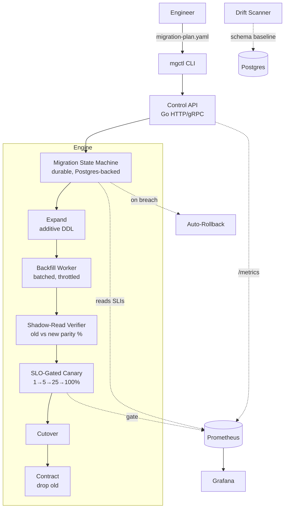

# Migration Safety Engine

> A zero-downtime, SLO-gated Postgres schema-migration engine. You declare the schema
> change; the engine runs **expand → backfill → shadow-read verify → SLO-gated canary
> cutover → contract**, and **auto-rolls-back** the instant latency, error rate, or data
> parity breaches a threshold. Built to be defended line-by-line in an interview.

**Stack:** Go · PostgreSQL · Prometheus · Docker Compose (Phase 1) → Terraform + ECS (Phase 2)
**One repo. Two résumés:** deep SRE (state machine, SLO gating, autoscaling, auto-rollback)
*and* enterprise FDE (declarative plan abstracts DB ops; zero-downtime cutover proven correct).

---

## Why this exists (the problem)

Online schema changes are the single most common cause of self-inflicted production
database outages: a change intended for one environment hits another, a "quick" `ALTER`
locks a hot table, a cutover flips before the new path is verified, and rollback is a
3 AM manual scramble. Most teams handle this with a hand-written runbook and a maintenance
window. This engine turns that runbook into a **declarative, observable, automatically
reversible control loop.**

### Scope discipline (what this deliberately is NOT)
To keep every line defensible, this is **Postgres-only** and uses a **plain Go state
machine persisted to Postgres** — no Temporal, no Debezium, no Envoy WASM mesh, no NATS
exactly-once 2PC, no etcd Raft, no React dashboard. Those are explicitly listed as the
"productization roadmap," not as-built. Breadth without depth reads as fake; one deep,
real, running slice does not.

---

## Architecture



**Control loop:** every state transition is persisted to a `migration_state` table, so a
crash resumes mid-migration. The canary reads SLIs from Prometheus and refuses to advance
(and rolls back) when a gate fails.

---

## The data model (this is where the "software" lives)

### `MigrationPlan` (declarative input)
```yaml
id: catalog-add-shipping-index
version: 42
table: catalog_product
strategy: expand-contract          # the only strategy in scope
expand:
  - "ALTER TABLE catalog_product ADD COLUMN shipping_class text"
  - "CREATE INDEX CONCURRENTLY idx_cp_shipping ON catalog_product (shipping_class)"
backfill:
  batch_size: 5000
  throttle_ms: 50                   # pace backfill to protect the live DB
  source_expr: "derive_shipping_class(weight, dims)"
verify:
  mode: shadow-read                 # run old + new read path, compare results
  parity_threshold: 0.999           # must match >= 99.9% before cutover
  sample_rate: 0.05
canary:
  steps: [1, 5, 25, 100]            # percent of read traffic on new path
  bake_seconds: 120                 # observe at each step
slo:
  max_p99_latency_ms: 50
  max_error_rate_pct: 0.1
  min_parity: 0.999
contract:
  - "ALTER TABLE catalog_product DROP COLUMN legacy_shipping"
on_failure: rollback                # rollback | pause
```

### State machine (Go)
```
Pending → Expanding → Backfilling → Verifying → Canary(1%) → Canary(5%)
        → Canary(25%) → Canary(100%) → Cutover → Contracting → Done
                                   │
                          (gate fail / error)
                                   ▼
                              RollingBack → RolledBack
```
Each node is a function that (a) does its work idempotently, (b) writes the new state +
checkpoint to Postgres, (c) emits metrics. Resume = read last state, re-enter that node.

---

## Repo layout

```
migration-safety-engine/
├── BLUEPRINT.md                  # this file
├── docker-compose.yml            # postgres + prometheus + grafana + the engine
├── Makefile                      # up / migrate / demo / test / lint
├── go.mod
├── cmd/
│   ├── engine/                   # control API + state-machine runner
│   └── mgctl/                    # CLI (cobra): plan apply, watch, rollback, drift scan
├── internal/
│   ├── plan/                     # MigrationPlan parse + validate
│   ├── statemachine/             # durable transitions, checkpoints, resume
│   ├── expand/                   # additive DDL executor (CONCURRENTLY-aware)
│   ├── backfill/                 # batched, throttled backfill worker
│   ├── verify/                   # shadow-read parity sampler + comparator
│   ├── canary/                   # traffic split + SLO gate (reads Prometheus)
│   ├── rollback/                 # reverse-path executor
│   ├── drift/                    # schema snapshot + diff vs baseline
│   ├── telemetry/                # custom Prometheus metrics
│   └── store/                    # Postgres state + checkpoint persistence
├── migrations/                   # the engine's own schema (state tables)
├── deploy/
│   └── terraform/                # Phase 2: ECS + RDS (BYO-VPC mode)
├── chaos/                        # latency-inject + kill-mid-migration scenarios
└── tests/                        # unit + integration (real PG via testcontainers)
```

---

## Custom metrics (the SRE signal)

```go
// Scale/observe on DOMAIN signals, never CPU — the senior-SRE talking point.
migrateParityScore   // gauge  0..1   per migration: shadow-read match ratio
migrateConvergeRows  // gauge          backfill rows remaining
migrateCanaryP99Ms   // gauge          p99 on the NEW path at current canary step
migrateProxyErrRate  // gauge          error rate on the NEW path
migrateRollbackReady // gauge  0/1     can we roll back right now with zero data loss?
migrateStateInfo     // gauge labeled  current state per migration_id (for dashboards)
```
The canary's autoscaling example: **backfill workers scale on `migrateConvergeRows`
(queue-depth-style), not CPU** — exactly the "don't scale data work on CPU" insight.

---

## The demo that sells it (one command)

```bash
make demo
# 1. seeds catalog_product with N rows on Postgres
# 2. mgctl plan apply -f examples/add-shipping-index.yaml
# 3. engine: expand → backfill (watch convergence) → shadow-read parity climbs to 0.999
# 4. canary 1%→5%→25% ... then `make inject-latency`
# 5. p99 on new path breaches 50ms → engine AUTO-ROLLS-BACK, prints reason
# 6. Grafana shows the whole timeline: parity, canary %, p99, rollback event
```
Two outcomes, both demoable: **clean success** (no fault) and **auto-rollback** (fault
injected). That contrast is the interview gold.

---

## Build order (each step independently demoable)

1. **State-machine skeleton** — `Pending→Done` happy path, persisted to Postgres, resumable.
2. **Expand + backfill** on one real table (batched, throttled).
3. **Shadow-read parity** verifier (sample, compare, compute %).
4. **SLO-gated canary** reading p99/error-rate from Prometheus.
5. **Auto-rollback** on gate breach (reverse-path executor + `rollback_ready` gate).
6. **`mgctl`** CLI + `drift scan` (schema snapshot vs baseline).
7. **Observability** — metrics + a Grafana dashboard JSON in-repo.
8. **One chaos test** — `chaos/inject-latency`, assert auto-rollback + zero data loss.
9. **README with real numbers** — "rolls back in < X s; zero data loss across N chaos runs."
10. **Phase 2 (optional)** — Terraform ECS + RDS, BYO-VPC install (the FDE deploy story).

---

## The split-narrative pitch (same project)

### SRE résumé bullets
- Built a durable, **Postgres-backed state machine** that orchestrates zero-downtime
  expand/contract schema migrations and **resumes mid-migration after a crash** (checkpointed
  transitions), validated with kill-during-migration chaos tests asserting zero data loss.
- Implemented **SLO-gated progressive cutover** (1→5→25→100% canary) that reads p99 latency
  and error rate from Prometheus and **auto-rolls-back within seconds** when a gate breaches.
- Designed **domain-metric autoscaling** for backfill workers (scale on rows-remaining, not
  CPU) and a `rollback_ready` invariant that blocks cutover whenever rollback would lose data.
- Shipped full observability (custom Prometheus metrics + Grafana timeline of parity, canary
  step, p99, and rollback events) and a GitOps-friendly CI that runs integration tests against
  a real Postgres.

### FDE résumé bullets
- Built a **declarative migration platform** (`MigrationPlan` YAML + `mgctl` CLI) that lets a
  team express *what* schema change they want — the engine infers and executes the safe
  zero-downtime path — replacing a multi-step manual runbook and maintenance window.
- Engineered **shadow-read parity verification** that runs the old and new read paths in
  parallel and **proves >99.9% data correctness before cutover**, turning "trust me" migrations
  into evidence-backed ones.
- Delivered a **bring-your-own-VPC deployment** (Terraform + Compose) so the engine runs inside
  a customer's environment against their own Postgres — abstracting the DB-ops complexity away
  from the client.
- Added a **continuous drift scanner** that flags out-of-band schema changes against a blessed
  baseline, giving the platform recurring value after the one-time migration completes.

---

## Productization roadmap (explicitly NOT built yet — say so in interviews)
Multi-engine support (MySQL/Mongo), CDC-based replication for cross-cluster moves, a managed
control plane, cost telemetry, and an executive dashboard. These are the "where it goes next"
slide, clearly labeled as roadmap, never as as-built.

---

## Confidentiality note (for the public version)
Keep the *patterns* ("a cross-environment apply caused a SEV1", "shared-cluster contamination
degraded a co-located DB") — never internal ticket IDs, incident numbers, or customer-facing
specifics. The engine's value stands on its own without them.
```
