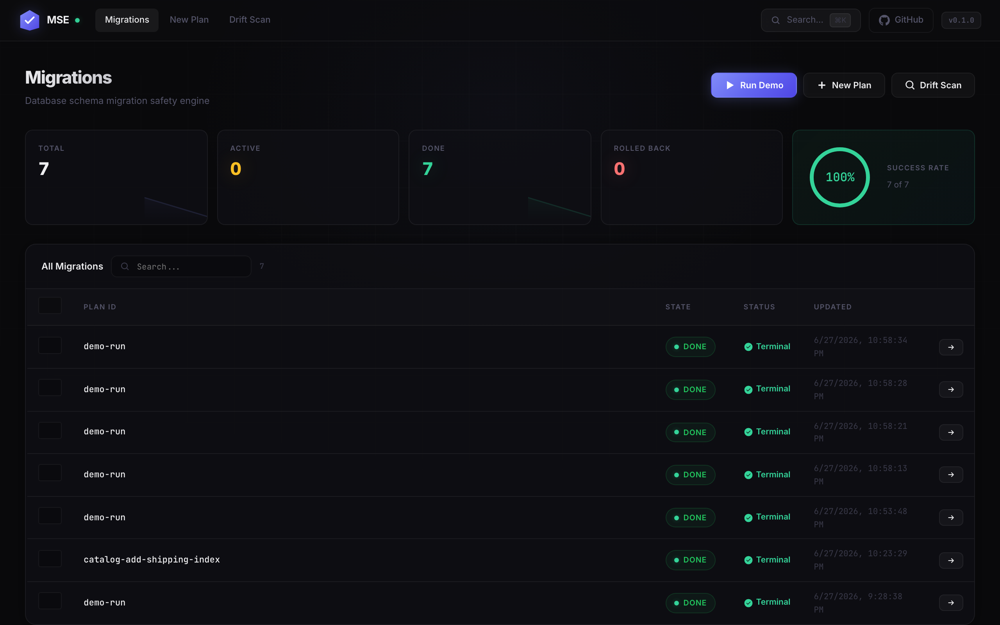
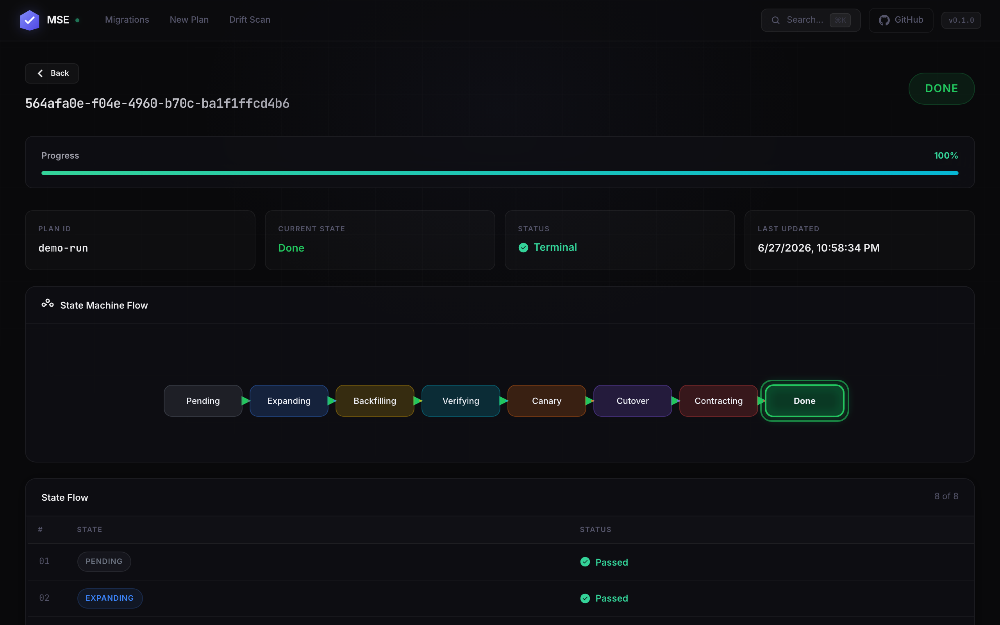
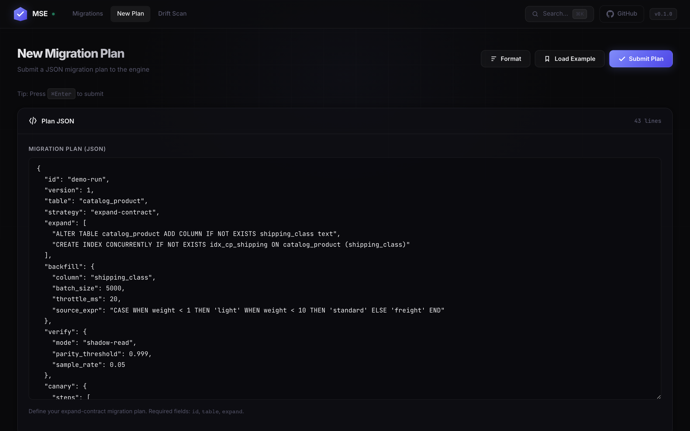
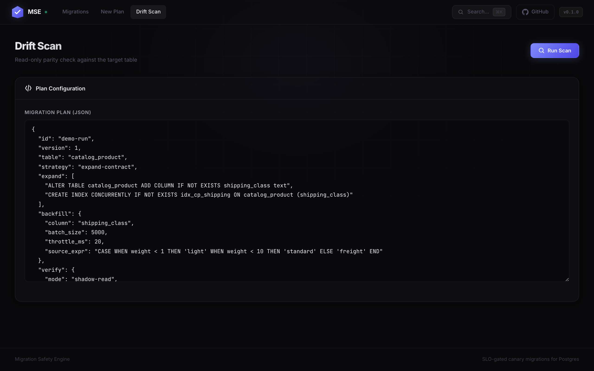
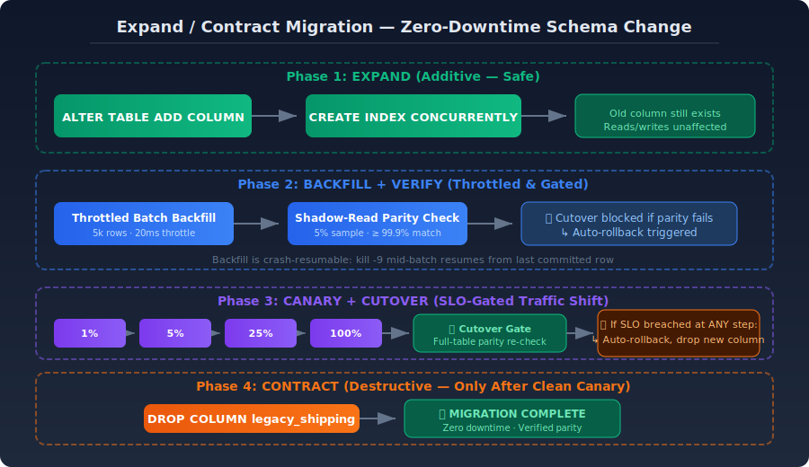

<p align="center">
  
</p>

<h3 align="center" style="color:#a1a1aa; font-weight:500; margin-top:-8px">SLO-gated canary migrations for Postgres. Automatic rollback when things go wrong.</h3>

<p align="center">
  <a href="https://github.com/iamyadavvikas/migration-safety-engine/actions/workflows/test.yml"></a>
  <a href="https://github.com/iamyadavvikas/migration-safety-engine/blob/main/LICENSE"></a>
  <a href="https://github.com/iamyadavvikas/migration-safety-engine/stargazers"></a>
</p>

---

> **The dangerous part of a schema change is never the `ALTER TABLE`.**
> It's the backfill that locks a hot table, the cutover that ships divergent data,
> and the rollback you didn't write.

Migration Safety Engine wraps your Postgres migrations in a **crash-resumable state machine** with
SLO-gated canary traffic shifts, data parity verification, and automatic rollback. If it can
kill your SLOs, it kills the migration — not your production.

**3 commands to try it:**

```bash
docker compose up -d && make migrate && make demo
```

Then open **http://localhost:8080** to watch the state machine in real time.

---

## Why This Exists

| What goes wrong | How often | Impact |
|----------------|-----------|--------|
| Backfill locks a hot table | 90% of teams | Customer queries time out |
| Index build blocks writes | Common | Production writes queue up |
| Backfilled data doesn't match source | Silent | Data corruption in reads |
| Cutover ships divergent data | Rare but catastrophic | Irreversible data loss |
| No rollback plan written | Most teams | Hours-long manual recovery |

**The result:** teams either don't migrate (accumulating tech debt) or migrate at 2 AM with a
rollback runbook they hope they never need.

---

## How It Works (Plain English)

Imagine you own a busy 10-lane highway and need to replace an exit ramp. You can't block all
lanes and dig — traffic stops. You need to:

1. **Build the new ramp alongside** (expand) — no traffic impact
2. **Redirect cars one lane at a time** (canary) — 1%, then 5%, then 25%, then 100%
3. **Check that no cars got lost** (parity verify) — every car that entered exited correctly
4. **Demolish the old ramp** (contract) — only after you're certain the new one works

MSE does exactly this for database schema changes — except the "cars" are millions of rows and
the "ramp" is a column or index.

---

## The State Machine

```
         ┌──────────┐
         │   Plan    │
         └────┬─────┘
              ▼
         ┌──────────┐
         │Validating│
         └────┬─────┘
              ▼
         ┌──────────┐         SLO breach
         │  Canary  │ ──────────────────────┐
         └────┬─────┘                        ▼
              │ pass                    ┌──────────┐
              ▼                         │Rolling   │
         ┌──────────┐                   │Back      │
         │  Running │                   └────┬─────┘
         └────┬─────┘                        ▼
              ▼                         ┌──────────┐
         ┌──────────┐                   │Rolled    │
         │Verifying │                   │Back      │
         └────┬─────┘                   └──────────┘
              ▼
         ┌──────────┐
         │ Completed │
         └──────────┘
```

Every step persists `(state, checkpoint)` to Postgres in a transaction. **Kill the process at any
point** — mid-backfill, mid-verify, even mid-rollback — and it resumes exactly where it left off.
Idempotent DDL and `WHERE col IS NULL` backfill batches make every step safe to re-enter.

---

## SLO-Gated Canary

At each canary step, the engine evaluates your SLOs:

```
1% traffic  ──► check p99 + error rate ──► pass ──► 5%
                                          fail ──► RollingBack
5% traffic  ──► check p99 + error rate ──► pass ──► 25%
                                          fail ──► RollingBack
...and so on through 100%
```

**No human in the loop.** A breach diverts the migration to `RollingBack` and runs your
authorised rollback DDL automatically.

---

## Demo: What Happens When Things Go Wrong

### Happy Path — `make demo`

Backfills **50,000 / 50,000** rows in throttled batches, verifies parity **1.0**, walks the
canary `1 → 5 → 25 → 100`, drops the legacy column, ends at **Done**:

```
state=Backfilling → Verifying → Canary → Contracting → Done
migrate_backfill_rows_done  = 50000
migrate_state_info{state="Done"} 1
```

### Auto-Rollback — `make demo-rollback`

Same plan plus a simulated fault at canary step 25%. The canary is healthy at 1% and 5%, then
p99 latency spikes to 101ms (breaching the 50ms SLO). The engine diverts to rollback:

```
canary step healthy  step=1  p99_ms=30
canary step healthy  step=5  p99_ms=30
canary SLO breach    step=25 why="p99 101ms > 50ms"
state advanced  Canary → RollingBack → RolledBack
migrate_rollbacks_total      = 1
```

### Load Under Backfill (Real Numbers)

16 concurrent writers hammer the target table **while** a 50k-row backfill + `CREATE INDEX
CONCURRENTLY` runs on the same table. Write p99 stayed at **4.43 ms** — 11× inside the 50 ms
SLO — with **zero errors**:

```
loadgen: 16 workers, 25s, table=catalog_product (max id=50000)
writes ok    : 289,296      throughput : 11,580 writes/s     errors : 0
latency p50  : 1.17ms        p95 : 2.66ms     p99 : 4.43ms     max : 85.67ms
migrate_cutover_parity = 1
```

---

## Why Not Just Use...

| Feature | MSE | pgroll | Bytebase | Atlas | Flyway | Liquibase |
|---------|-----|--------|----------|-------|--------|-----------|
| **SLO-gated canary** | ✅ | ❌ | ❌ | ❌ | ❌ | ❌ |
| **Crash-resume** | ✅ | ❌ | ✅ | ❌ | ❌ | ❌ |
| **Auto-rollback on SLO breach** | ✅ | ❌ | ❌ | ❌ | ❌ | ❌ |
| **Data parity verification** | ✅ | ❌ | ❌ | ❌ | ❌ | ❌ |
| **Zero-downtime** | ✅ | ✅ | ✅ | ⚠️ | ❌ | ❌ |
| **Deterministic rollback** | ✅ | ✅ | ⚠️ | ❌ | ✅ | ✅ |
| **Web dashboard** | ✅ | ❌ | ✅ | ✅ | ❌ | ❌ |
| **Postgres-native** | ✅ | ✅ | ⚠️ | ⚠️ | ⚠️ | ⚠️ |
| **Language** | Go | Go | Go | Go | Java | Java |
| **Open source** | Apache 2.0 | Apache 2.0 | MIT | Apache 2.0 | MIT | Apache 2.0 |
| **Self-hostable** | ✅ | ✅ | ✅ | ✅ | ✅ | ✅ |
| **Pricing** | Free + cloud | Free | $20/user/mo | Free + cloud | $2.5K+/mo | Contact sales |

**The gap:** No existing tool combines migration execution + runtime SLO monitoring + canary
deployment + auto-rollback. pgroll has rollback but no SLO awareness. Flyway/Liquibase have
rollback scripts but no canary. Atlas has linting but no runtime safety.

---

## Screenshots

### Dashboard


### Migration Detail — Live Prometheus Charts


### New Migration Plan


### Drift Scan


### Architecture Overview

---

## Quick Start

### Prerequisites
- Docker & Docker Compose
- Go 1.24+

### 30 seconds

```bash
git clone https://github.com/iamyadavvikas/migration-safety-engine.git
cd migration-safety-engine
docker compose up -d
make migrate
make demo
```

Open **http://localhost:8080** — you'll see the dashboard with your migration's state machine
animating through each phase in real time.

### More demos

```bash
make demo-rollback        # SLO breach → auto-rollback → RolledBack
make load-under-backfill  # concurrent writes WHILE a migration backfills
```

### Services

| Service | URL | Credentials |
|---------|-----|-------------|
| Engine UI & API | http://localhost:8080 | — |
| Prometheus | http://localhost:9093 | — |
| Grafana | http://localhost:3004 | anonymous (Admin) |

---

## The Migration Plan

A migration is a single declarative YAML document — *what* to change, not *how*:

```yaml
id: catalog-add-shipping-index
version: 42
table: catalog_product
strategy: expand-contract

expand:                       # additive DDL; index built CONCURRENTLY
  - "ALTER TABLE catalog_product ADD COLUMN IF NOT EXISTS shipping_class text"
  - "CREATE INDEX CONCURRENTLY IF NOT EXISTS idx_cp_shipping ON catalog_product (shipping_class)"

backfill:                     # throttled, resumable batches
  column: shipping_class
  batch_size: 5000
  throttle_ms: 20
  source_expr: "CASE WHEN weight < 1 THEN 'light' WHEN weight < 10 THEN 'standard' ELSE 'freight' END"

verify:                       # shadow-read parity before cutover
  mode: shadow-read
  parity_threshold: 0.999
  sample_rate: 0.05

canary:
  steps: [1, 5, 25, 100]
  bake_seconds: 120

slo:                          # gate evaluated at every canary step
  max_p99_latency_ms: 50
  max_error_rate_pct: 0.1
  min_parity: 0.999

contract:                     # destructive cleanup, only after clean canary
  - "ALTER TABLE catalog_product DROP COLUMN IF EXISTS legacy_shipping"

rollback:                     # auto-applied if canary breaches SLO
  - "DROP INDEX IF EXISTS idx_cp_shipping"
  - "ALTER TABLE catalog_product DROP COLUMN IF EXISTS shipping_class"

on_failure: rollback
```

---

## Observability

### Metrics (`/metrics`)

| Metric | Type | Meaning |
|--------|------|---------|
| `migrate_state_info{state}` | gauge | Current state (1 = active) |
| `migrate_state_transitions_total{to_state}` | counter | State transitions |
| `migrate_backfill_rows_total` / `_done` | gauge | Backfill progress |
| `migrate_verify_parity` | gauge | Shadow-read parity ratio |
| `migrate_cutover_parity` | gauge | Full-table parity at cutover gate |
| `migrate_canary_step_pct` | gauge | Current canary traffic % |
| `migrate_rollbacks_total` | counter | Auto-rollbacks triggered |

### Alerts

- **MigrationStuck** — non-terminal state for >10m
- **MigrationAutoRolledBack** — a rollback fired (critical)
- **MigrationLowParity** — parity below threshold
- **EngineDown** — scrape target down

---

## Production Safety Layers

MSE includes built-in safety safeguards for production DDL execution:

### DDL Safety Executor (`internal/safety/ddl.go`)

All DDL statements (expand, contract, rollback) are wrapped with:

- **Lock Timeout**: `SET LOCAL lock_timeout = '3s'` — prevents DDL from waiting indefinitely for locks
- **Statement Timeout**: `SET LOCAL statement_timeout = '60s'` — prevents runaway DDL from blocking the system
- **Pre-flight Checks**: Queries `pg_stat_activity` for lock contention and `pg_stat_replication` for lag before executing
- **Execution Logging**: All DDL executions are logged with timing, success/failure, and error messages

### Adaptive Backfill Throttling (`internal/safety/throttle.go`)

The backfill handler dynamically adjusts based on real-time DB health:

- **Health Score**: Weighted composite of connection pool, replication lag, lock queue, and table bloat
- **Dynamic Batch Size**: Adjusts from `MinBatchSize` to `MaxBatchSize` based on health
- **Dynamic Throttle**: Adjusts from `MinThrottleMs` to `MaxThrottleMs` based on health
- **Circuit Breaker**: Trips when health score drops below 0.1, preventing further writes

### Safety Tables

Three new tables track safety metrics:

| Table | Purpose |
|-------|---------|
| `ddl_execution_log` | Records all DDL executions with timing and errors |
| `backfill_progress` | Tracks batch progress with health metrics |
| `canary_observation` | Logs canary step observations and SLO breaches |

### API Endpoints

| Endpoint | Description |
|----------|-------------|
| `GET /migrations/{id}/safety` | DDL execution logs for a migration |
| `GET /migrations/{id}/backfill` | Backfill progress with health metrics |
| `GET /migrations/{id}/canary` | Canary observations and SLO breaches |

---

## Crash-Resume, Proven in Tests

Four integration tests against a real Postgres:

- **TestResumeAfterCrash** — kill migration, restart, assert it resumes from checkpoint
- **TestCanaryAutoRollback** — chaos plan → SLO breach → `RolledBack`
- **TestRollbackResumesAfterCrash** — killed mid-rollback → resumes to `RolledBack`
- **TestCutoverAbortsOnDrift** — drift at cutover gate → aborts, legacy column preserved

```bash
make test        # unit always; integration when MSE_TEST_DSN is set
```

---

## Repo Layout

| Path | What |
|------|------|
| `cmd/engine` | HTTP control API + state-machine runner |
| `cmd/mgctl` | operator CLI (`plan apply`, `status`, `watch`, `drift-scan`) |
| `cmd/loadgen` | concurrent write load generator |
| `internal/plan` | declarative `MigrationPlan` + parse/validate |
| `internal/statemachine` | durable runner + handlers + drift scan |
| `internal/store` | pgxpool persistence (state, checkpoints, events) |
| `internal/telemetry` | Prometheus metrics |
| `frontend/` | React 19 + TypeScript + D3.js dashboard (embedded via `go:embed`) |
| `migrations/` | engine control schema + demo target table |
| `examples/` | happy-path + chaos migration plans |
| `monitoring/` | Prometheus config, alert rules, Grafana dashboard |

---

## What This Demonstrates

**SRE / DevOps**
- Crash-resumable state machine for online Postgres schema changes
- SLO-gated progressive canary with auto-rollback on breach — zero human intervention
- Load-tested: 16 concurrent writers at ~11.6k writes/s, 4.4ms p99, zero errors
- Read-only drift scanner for CI/cron

**Forward-Deployed Engineering**
- Risky manual runbook → single declarative YAML plan
- Shadow-read parity verification catches silent data divergence
- One-command demos make the safety story reproducible end-to-end

---

## Contributing

See [CONTRIBUTING.md](CONTRIBUTING.md) for guidelines.

## License

[Apache 2.0](LICENSE)
