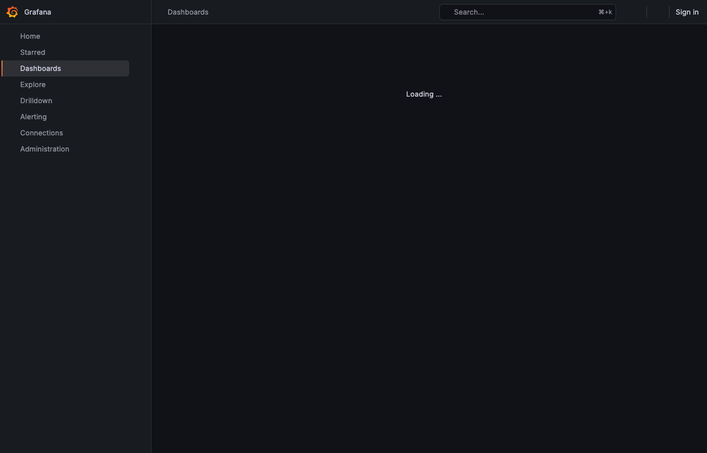
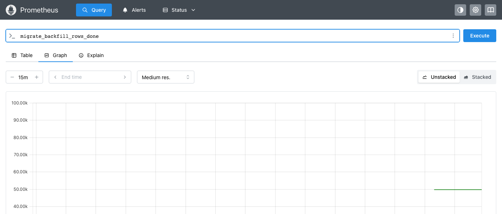
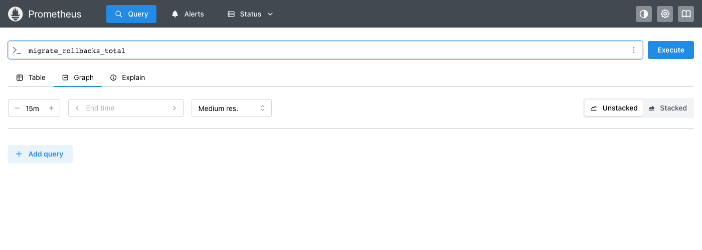
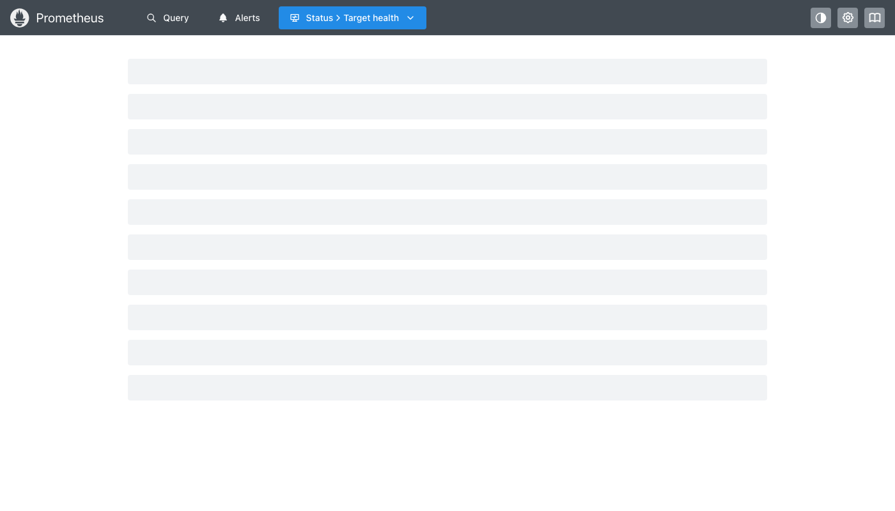
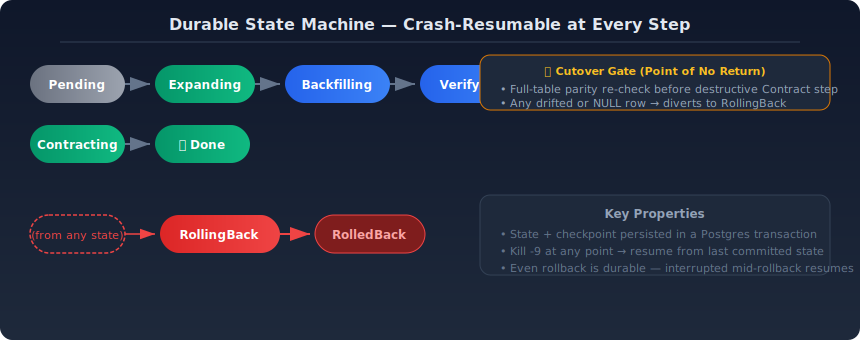
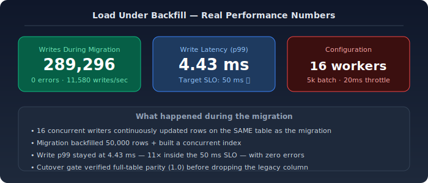

# Migration Safety Engine

[](https://go.dev)
[](https://postgresql.org)
[](LICENSE)

A **crash-resumable state machine** for safe, online Postgres schema migrations. Uses the
expand/contract pattern with shadow-read parity verification, SLO-gated canary traffic shifts,
automatic rollback on breach, and a post-migration drift scanner.

**It exists because the dangerous part of a schema change is never the `ALTER TABLE` — it's the
backfill that locks a hot table, the cutover that ships divergent data, and the rollback you
didn't write.**

---

## How It Works (Plain English)

Imagine you own a busy 10-lane highway and need to replace an exit ramp. You can't just block
all lanes and dig — traffic stops. You need to:

1. **Build the new ramp alongside** (expand) — no traffic impact
2. **Redirect cars one lane at a time** (canary) — 1%, then 5%, then 25%, then 100%
3. **Check that no cars got lost** (parity verify) — every car that entered exited correctly
4. **Demolish the old ramp** (contract) — only after you're certain the new one works

The Migration Safety Engine does exactly this for database schema changes — except the "cars" are
millions of database rows and the "ramp" is a column or index.

It's also **crash-resumable**: if the server dies mid-migration, it picks up exactly where it
left off, not from the start. Like a download manager that survives your laptop rebooting.

---

## Screenshots

| Grafana Dashboard | Prometheus Metrics |
|---|---|
|  |  |
| State machine, backfill progress, canary %, parity, rollbacks | Real-time metrics from a live migration run |

| Auto-Rollback Detection | Infrastructure Targets |
|---|---|
|  |  |
| `migrate_rollbacks_total` counter on SLO breach | Engine + Postgres exporter scrape targets |

---

## Problem Statement

**The scenario:** Your production Postgres database serves a live customer-facing application. You
need to add a new column, backfill millions of rows from existing data, and eventually drop the
legacy column.

**What goes wrong 90% of the time:**

| Failure | Impact |
|---------|--------|
| Backfill locks the table | Customer queries time out |
| Index build blocks writes | Production writes queue up |
| Backfilled data doesn't match source | Silent data corruption in reads |
| Cutover ships divergent data | Irreversible data loss |
| No rollback plan written | Hours-long manual recovery |

**Why existing tools fall short:**
- **Atlas / Sqawk** — lint schema changes statically but don't govern the *runtime* execution
- **gh-ost** — handles MySQL migrations gracefully but has no Postgres equivalent
- **Ad-hoc scripts** — no durability, no verification, no auto-rollback, no observability

The result: teams either don't migrate (accumulating tech debt) or migrate at 2 AM with a
rollback runbook they hope they never need.

---

## Solution

The Migration Safety Engine turns a risky manual runbook into a declarative YAML plan — reviewed
in git, executed by a durable state machine, gated by SLOs and parity checks, and auto-rolled
back on failure.


### The Four-Phase Expand/Contract Pattern

```
Phase 1: EXPAND   → Add column + index CONCURRENTLY      (zero impact)
Phase 2: BACKFILL → Throttled batches with crash resume   (throttled)
Phase 3: CANARY   → Shift traffic 1%→5%→25%→100%        (gate at each step)
Phase 4: CONTRACT → Drop legacy column                   (only after clean canary)
```

### Durable State Machine



Every step persists `(state, checkpoint)` to Postgres in a transaction. The engine can be killed
at any point — mid-backfill, mid-verify, even mid-rollback — and resumes exactly where it left
off. Idempotent DDL and `WHERE col IS NULL` backfill batches make every step safe to re-enter.

The **Cutover** state is the point of no return: it recomputes parity across the *entire* table
before allowing the destructive Contracting step. On drift, it routes to RollingBack instead.

### SLO-Gated Canary with Auto-Rollback

```
1% traffic  ──► check p99 + error rate ──► pass ──► 5%
                                              fail ──► RollingBack
5% traffic  ──► check p99 + error rate ──► pass ──► 25%
                                              fail ──► RollingBack
...and so on through 100%
```

At each step the engine evaluates the plan's SLO (`max_p99_latency_ms`, `max_error_rate_pct`).
A breach diverts the migration to `RollingBack` and runs the operator-authored rollback DDL —
no human in the loop.

---

## Demos (Real Output)

### Happy Path — `make demo`

Backfills **50,000 / 50,000** rows in throttled batches, verifies parity **1.0** on a ~2,500-row
sample, walks the canary `1 → 5 → 25 → 100`, drops the legacy column, ends at **Done**:

```
state=Backfilling → Verifying → Canary → Contracting → Done
migrate_backfill_rows_done  = 50000
migrate_backfill_rows_total = 50000
migrate_state_info{state="Done"} 1
```

### Auto-Rollback on SLO Breach — `make demo-rollback`

Same plan plus a simulated fault at canary step 25%. The canary is healthy at 1% and 5%, then
p99 latency spikes to 101ms (breaching the 50ms SLO). The engine diverts to rollback
automatically:

```
canary step healthy  step=1  p99_ms=30
canary step healthy  step=5  p99_ms=30
canary SLO breach    step=25 why="p99 101ms > 50ms"
state advanced  Canary → RollingBack → RolledBack
migrate_rollbacks_total      = 1
migrate_canary_step_pct      = 25
```

### Load Under Backfill (Real Numbers)

16 concurrent writers hammer the target table **while** a 50k-row backfill + `CREATE INDEX
CONCURRENTLY` runs on the same table. Write p99 stayed at **4.43 ms** — 11× inside the 50 ms
SLO — with **zero errors**:

```
loadgen: 16 workers, 25s, table=catalog_product (max id=50000)
writes ok    : 289,296      throughput : 11,580 writes/s     errors : 0
latency p50  : 1.17ms        p95 : 2.66ms     p99 : 4.43ms     max : 85.67ms
migrate_cutover_parity = 1   # cutover committed over all 50,000 rows
```



### Drift Scanner

Prove a finished migration still has zero divergence. Exits non-zero on drift — drop it in CI:

```bash
go run ./cmd/mgctl drift-scan -f examples/add-shipping-index.yaml
# table=catalog_product column=shipping_class total=50000 nulls=0 drifted=0 parity=1.00000

# corrupt 7 rows, then re-scan:
# table=catalog_product column=shipping_class total=50000 nulls=0 drifted=7 parity=0.99986
# error: drift detected: 7/50000 rows diverge   (exit 1)
```

---

## Quick Start

Requires Docker and Go 1.24+.

```bash
git clone https://github.com/iamyadavvikas/migration-safety-engine.git
cd migration-safety-engine

make up          # postgres + prometheus + grafana
make migrate     # engine control schema + demo target table (50k rows)
make run         # start the engine on :8080 (control API + /metrics)
```

In a second shell:

```bash
make demo                 # drive the happy-path plan end-to-end → Done
make demo-rollback        # drive the chaos plan → SLO breach → auto-rollback → RolledBack
make load-under-backfill  # concurrent writes WHILE a migration backfills
```

| Service | URL | Credentials |
|---------|-----|-------------|
| Prometheus | http://localhost:9090 | — |
| Grafana | http://localhost:3002 (or :3000) | anonymous (Admin) |
| Engine API | http://localhost:8080 | — |

> Port note: Grafana is mapped to `:3002` (not `:3000`) to avoid collisions with common local
> apps. The container still listens on `:3000` internally — Grafana's `SERVER_HTTP_PORT` is not
> changed. The dashboard is auto-provisioned from `monitoring/grafana/`.

---

## The Migration Plan

A migration is a single declarative YAML document — *what* to change, not *how*:

```yaml
id: catalog-add-shipping-index
version: 42
table: catalog_product
strategy: expand-contract

expand:                       # additive DDL; index built CONCURRENTLY (runs outside a tx)
  - "ALTER TABLE catalog_product ADD COLUMN IF NOT EXISTS shipping_class text"
  - "CREATE INDEX CONCURRENTLY IF NOT EXISTS idx_cp_shipping ON catalog_product (shipping_class)"

backfill:                     # throttled, resumable batches over rows WHERE col IS NULL
  column: shipping_class
  batch_size: 5000
  throttle_ms: 20
  source_expr: "CASE WHEN weight < 1 THEN 'light' WHEN weight < 10 THEN 'standard' ELSE 'freight' END"

verify:                       # shadow-read parity before cutover
  mode: shadow-read
  parity_threshold: 0.999
  sample_rate: 0.05

canary:
  steps: [1, 5, 25, 100]
  bake_seconds: 120

slo:                          # gate evaluated at every canary step
  max_p99_latency_ms: 50
  max_error_rate_pct: 0.1
  min_parity: 0.999

contract:                     # destructive cleanup, only after a clean canary
  - "ALTER TABLE catalog_product DROP COLUMN IF EXISTS legacy_shipping"

rollback:                     # auto-applied if the canary breaches the SLO
  - "DROP INDEX IF EXISTS idx_cp_shipping"
  - "ALTER TABLE catalog_product DROP COLUMN IF EXISTS shipping_class"

on_failure: rollback
```

---

## Observability

### Metrics (`/metrics`)

| Metric | Type | Meaning |
|--------|------|---------|
| `migrate_state_info{migration_id,plan_id,state}` | gauge | current state (1 = active) |
| `migrate_state_transitions_total{plan_id,to_state}` | counter | state transitions |
| `migrate_backfill_rows_total` / `_done` | gauge | backfill progress |
| `migrate_verify_parity` | gauge | last shadow-read parity ratio |
| `migrate_cutover_parity` | gauge | full-table parity at the cutover gate |
| `migrate_canary_step_pct` | gauge | current canary traffic % |
| `migrate_rollbacks_total` | counter | auto-rollbacks triggered |

### Alerts (`monitoring/alerts.yml`)

- **MigrationStuck** — non-terminal state for >10m
- **MigrationAutoRolledBack** — a rollback fired (critical)
- **MigrationLowParity** — parity below threshold
- **EngineDown** — scrape target down

### Dashboard

`monitoring/grafana/dashboards/migration-safety-engine.json` — 7 auto-provisioned panels (state
timeline, backfill rows, completion %, parity trend, canary %, transition rate, rollbacks).

---

## Crash-Resume, Proven in Tests

Four integration tests against a real Postgres (set `MSE_TEST_DSN`; they skip otherwise):

- **`TestResumeAfterCrash`** — interrupt a migration, restart the runner, assert it finishes from
  the persisted checkpoint.
- **`TestCanaryAutoRollback`** — drive the chaos plan; assert the canary breach ends in
  `RolledBack` with the new column dropped.
- **`TestRollbackResumesAfterCrash`** — a migration killed *mid-rollback* resumes and completes to
  `RolledBack` (rollback is itself durable).
- **`TestCutoverAbortsOnDrift`** — drift at the cutover gate aborts and rolls back; the legacy
  column is **never** dropped on top of bad data.

```bash
make test        # unit always; integration when MSE_TEST_DSN is set
```

---

## Repo Layout

| Path | What |
|------|------|
| `cmd/engine` | HTTP control API + state-machine runner |
| `cmd/mgctl` | operator CLI (`plan apply`, `status`, `watch`, `drift-scan`) |
| `cmd/loadgen` | concurrent write load generator |
| `internal/plan` | declarative `MigrationPlan` + parse/validate |
| `internal/statemachine` | durable runner + handlers + drift scan |
| `internal/store` | pgxpool persistence (state, checkpoints, events) |
| `internal/telemetry` | Prometheus metrics |
| `migrations/` | engine control schema + demo target table |
| `examples/` | happy-path + chaos migration plans |
| `monitoring/` | Prometheus config, alert rules, Grafana dashboard |
| `scripts/` | `demo.sh`, `demo_rollback.sh` |

---

## What This Demonstrates

**SRE / DevOps**
- Crash-resumable state machine for online Postgres schema changes — persists state
  transactionally so a killed process resumes exactly where it stopped (mid-backfill across 50k
  rows or mid-rollback).
- SLO-gated progressive canary (p99 latency + error-rate at 1/5/25/100%) + full-table cutover
  gate with auto-rollback on breach or drift — zero human intervention.
- Load-tested: 16 concurrent writers at ~11.6k writes/s, 4.4 ms p99, zero errors *while* a 50k-row
  backfill and `CREATE INDEX CONCURRENTLY` ran on the same table.
- Read-only drift scanner for CI/cron — re-verifies data convergence post-migration.

**Forward-Deployed Engineering**
- Turned a risky manual runbook into a single declarative YAML plan — reviewable, observable,
  gated, and reversible.
- Shadow-read parity verification (sampled at verify, full-table at cutover gate) catches silent
  data divergence before it reaches production reads.
- One-command demos make the safety story reproducible end-to-end in minutes.
