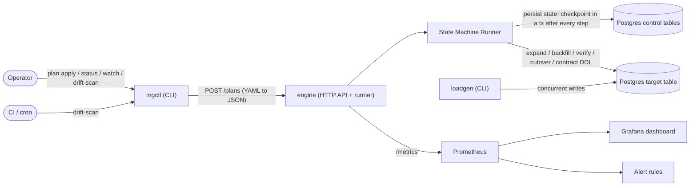
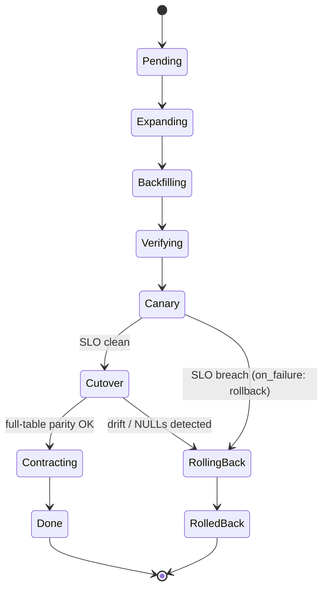

# Migration Safety Engine — Interview Prep

A complete brief for explaining this project in an interview (SRE / DevOps / FDE).
Everything here is grounded in the actual code in this repo.

---

## 1. The Problem — framed for a high-traffic checkout system

**One sentence:** On a high-traffic system (think e‑commerce checkout), changing the shape of a
big database table — add/rename/drop a column, add an index — is one of the riskiest operations
in production, and most teams do it by hand, under stress, with no safety net.

Three things make schema changes on hot, transactional tables (carts, orders, line items,
catalog) dangerous:

| Failure mode | What actually happens in prod |
|---|---|
| **Locking** | A naive `ALTER TABLE ... ADD COLUMN` with a default, or `CREATE INDEX` without `CONCURRENTLY`, takes a heavy lock. Every checkout query queues behind it → latency spike → timeouts → an effective partial outage during peak. |
| **Silent data divergence** | You add a new column and backfill it from old data. If the backfill logic is subtly wrong, the new column holds *bad data*. The deploy goes green, but customers now read wrong prices/shipping/state. |
| **No clean rollback** | The migration dies halfway (deploy crashes, DB failover, Ctrl‑C). The table is in a half‑migrated state and nobody wrote the "undo." You improvise recovery during an incident. |

So teams face a bad choice: **take downtime** (unacceptable for checkout) or **do it manually and
pray**. The careful "expand/contract" technique senior engineers use is tribal knowledge in a
runbook, not enforced by tooling.

> **Honest framing:** This is a real class of problem a Cart & Checkout SRE faces. This repo is a
> portfolio build (not deployed in any company's prod), but it *productizes the exact manual
> discipline* — expand/contract → verify → canary → rollback — and makes it crash-safe and
> self-verifying.

---

## 2. The Solution — in plain English

You write *what* you want changed in a single YAML plan; the engine figures out *how* to do it
safely:

1. **Expand first (never break readers).** Add the new column and build the index `CONCURRENTLY`
   — no table lock. Old and new shapes coexist.
2. **Backfill slowly.** Copy data into the new column in small throttled batches (e.g. 5,000 rows,
   20 ms pause) so live traffic never feels it.
3. **Verify (shadow-read parity).** Before trusting the new column, compare it against the source
   rule. If they don't match past a threshold (e.g. 99.9%), **stop**.
4. **Canary with SLO gates.** Shift traffic `1% → 5% → 25% → 100%`. At each step check p99 latency
   + error rate against the plan's SLO. Any breach → **auto-rollback**, no human needed.
5. **Cutover = point of no return.** Before the destructive "drop old column" step, re-prove
   parity over the **entire** table (not a sample). Any drift → abort and roll back. The old
   column is *never* dropped on top of bad data.
6. **Contract.** Only now drop the legacy column.
7. **Crash-safe throughout.** After *every* step it writes state + checkpoint to Postgres in a
   transaction. `kill -9` it mid-backfill and it resumes from the last committed batch. Even an
   interrupted *rollback* resumes to completion.

**Proven, not just claimed:** the bundled load generator ran 16 concurrent writers =
**~11,600 writes/s, p99 4.43 ms, 0 errors** *while* a 50k-row backfill + `CREATE INDEX
CONCURRENTLY` ran on the same table.

---

## 3. Architecture

### Component / system view



### State machine



Every handler persists `(state, checkpoint)` to Postgres *before* returning. On startup the runner
re-loads the last persisted state and continues. Idempotent DDL (`IF [NOT] EXISTS`) +
`WHERE col IS NULL` backfill batches make every step safe to re-enter — including `RollingBack`.

### Durability mechanism (why `kill -9` is safe)

```mermaid
sequenceDiagram
    participant R as Runner
    participant PG as Postgres (control)
    participant T as Target table
    R->>T: backfill batch (5000 rows WHERE col IS NULL)
    R->>PG: BEGIN; SaveCheckpoint(state, checkpoint); COMMIT
    Note over R: crash here
    R-->>R: restart
    R->>PG: Load(id) -> last committed state+checkpoint
    R->>T: resume backfill (only rows still NULL)
```

---

## 4. Code map — functions & what they do

### `internal/plan` — the declarative contract
- `Parse(path)` — reads the YAML plan into a `MigrationPlan` struct.
- `(*MigrationPlan).Validate()` — defaults + validation; validates `table` and `backfill.column`
  as plain SQL identifiers (injection guard) and rejects bad canary steps.

### `internal/store` — durable persistence (Postgres via pgxpool)
- `New(ctx, dsn)` — opens a `pgxpool` connection pool.
- `CreateMigration(...)` — inserts a new migration row in a chosen initial state.
- `Load(ctx, id)` — re-hydrates a migration (state + checkpoint); this is what makes resume work.
- `SaveState(...)` — transactional state transition + checkpoint + event; marks terminal.
- `SaveCheckpoint(...)` — persists progress *within* a state (e.g. backfill offset).
- `FindResumable(ctx)` — on boot, finds non-terminal migrations to pick back up.

### `internal/statemachine` — the runner + handlers
- `NewRunner(...)` / `Run(ctx, id)` — load state → run handler → persist → advance.
- `defaultHandlers()` — maps each `State` to its handler.
- Handlers: `expand`, `backfill`, `verify`, `canary`, `cutover`, `rollback`, `contract`.
- `fullTableParity(...)` — full-table `count(*) FILTER (WHERE col IS DISTINCT FROM expr)`; shared
  by the cutover gate and `DriftScan`.
- `DriftScan(...)` — read-only post-migration verification; exits non-zero on drift (CI/cron).
- `observeCanary(...)` / `sloBreached(...)` — the SLO gate logic.

### `internal/telemetry` — Prometheus metrics
- `SetState`, `SetBackfill`, `SetParity`, `SetCutoverParity`, `SetCanaryStep`, `IncRollback`.

### Entry points (`cmd/`)
- `cmd/engine` — HTTP control API (`/healthz`, `/metrics`, `POST /plans`, `POST /drift-scan`,
  `GET /migrations/{id}`) + runner.
- `cmd/mgctl` — operator CLI (`plan apply`, `status`, `watch`, `drift-scan`).
- `cmd/loadgen` — concurrent write load generator (write p50/p95/p99).

---

## 5. Libraries used (and why)

| Library | Role | Why |
|---|---|---|
| `github.com/jackc/pgx/v5` (+ `pgxpool`) | Postgres driver + pool | High-performance native Postgres driver; proper pooling; needed for `CREATE INDEX CONCURRENTLY` (which can't run in a transaction). |
| `github.com/spf13/cobra` | CLI framework | Powers `mgctl` + engine subcommands; standard for Go CLIs. |
| `github.com/prometheus/client_golang` | Metrics | Exposes `/metrics`; gauges/counters for state, backfill, parity, canary, rollbacks. |
| `gopkg.in/yaml.v3` | Plan parsing | The migration plan is declarative YAML. |
| `github.com/google/uuid` | Migration IDs | Stable unique key per migration run. |
| stdlib `log/slog` | Structured logging | Built-in; no extra dependency. |
| stdlib `net/http` | Control API | A handful of routes; no framework needed. |

Go **1.24**, module path `github.com/iamyadavvikas/migration-safety-engine`.

---

## 6. Likely interview questions — with answers

**Why expand/contract instead of just `ALTER TABLE`?**
A naive alter (esp. with a default or an index) locks a hot table and stalls traffic.
Expand/contract adds new structure additively, backfills off the critical path, and only drops the
old structure after the new one is proven — readers/writers are never broken mid-flight.

**How do you avoid locking during the index build?**
`CREATE INDEX CONCURRENTLY`. It can't run inside a transaction, which is why the expand handler
runs those statements outside a tx — a real gotcha the engine handles.

**How is the backfill safe under load?**
Throttled batches (`batch_size`, `throttle_ms`) over `WHERE col IS NULL`. Small batches = short
locks; the throttle yields to live traffic. Proven: 11.6k writes/s at 4.43 ms p99, 0 errors,
*during* a backfill.

**What exactly makes it crash-resumable?**
After every step, `(state, checkpoint)` is committed to Postgres transactionally. Restart calls
`Load()` and continues. Idempotent DDL + `IS NULL` batches make re-entering a step always safe —
no corrupt half-state. Even mid-*rollback* resumes (`TestRollbackResumesAfterCrash`).

**Why verify twice (sampled at verify, full-table at cutover)?**
Sampling at `verify` is cheap and catches gross errors early before wasting a canary. The cutover
gate is the commit point — dropping the legacy column is irreversible — so there it pays for a
full-table `IS DISTINCT FROM` scan. No NULLs, no drift, or it aborts and rolls back.

**How does auto-rollback decide to fire?**
`observeCanary` collects p99 latency + error rate per step; `sloBreached` compares to the plan's
`slo`. On breach with `on_failure: rollback`, the runner diverts to `RollingBack` and runs the
operator-authored rollback DDL — zero humans.

**Isn't raw SQL in the YAML an injection risk?**
`table` and `backfill.column` are validated as plain SQL identifiers before interpolation. The
`expand/contract/rollback` DDL and `source_expr` are intentionally raw — this is an operator tool;
whoever authors a plan already holds full DDL rights on that DB. It's a trust boundary, not an
untrusted-input boundary.

**How do you observe it in production?**
Custom Prometheus metrics (state, backfill progress, verify/cutover parity, canary %, rollbacks),
4 alert rules (MigrationStuck, MigrationAutoRolledBack, MigrationLowParity, EngineDown), and a
7-panel Grafana dashboard — all in-repo and auto-provisioned.

**How is it tested?**
Four integration tests against a real Postgres: resume-after-crash, canary-auto-rollback,
rollback-resumes-after-crash, cutover-aborts-on-drift. They skip without `MSE_TEST_DSN` so unit
tests still run anywhere.

**What are the limits / what's next?**
The canary traffic shift is modeled/observed, not wired to a real load balancer; the SLO signals
are injected in the demo rather than scraped from prod. Next: integrate real traffic-splitting
(service mesh / weighted routing), pull SLO signals from actual Prometheus, multi-table /
FK-aware plans, and a dry-run / plan-diff mode.

---

## 7. 30-second verbal pitch

> Schema changes on hot checkout tables are high-risk: locking, silent data divergence, and no
> rollback. I built a Go engine that runs migrations as a durable state machine — expand/contract
> with concurrent index builds, throttled resumable backfill, shadow-read parity verification, an
> SLO-gated canary that auto-rolls-back on breach, and a full-table cutover gate that refuses to
> drop the old column on top of bad data. Every step is checkpointed to Postgres, so a `kill -9`
> resumes cleanly. I load-tested it: 11.6k writes/s at 4 ms p99 with zero errors while a 50k-row
> backfill and a concurrent index build ran. It's the manual SRE migration runbook, turned into
> crash-safe, observable tooling.
